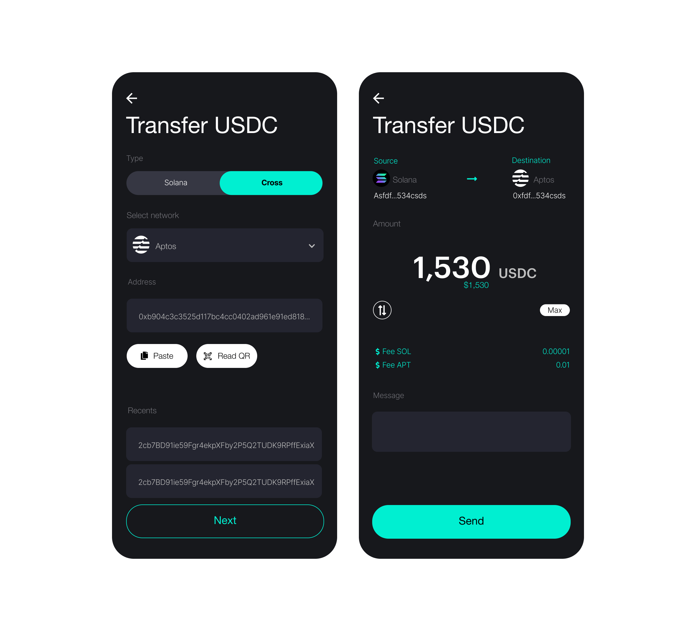

# Cross-chain Transfers

Transfers cross chain are enabled for all the supported networks **Ned Wallet**
has. For each transfer, users must pay the fees in both chains, so the user must
have a enough balance in both accounts (sender and receiver) to pay for fees.

:::info

Cross transfer are enabled by wormhole, we recommend to read
[wormhole's documentation](https://wormhole.com/) to understand how it works.

:::
