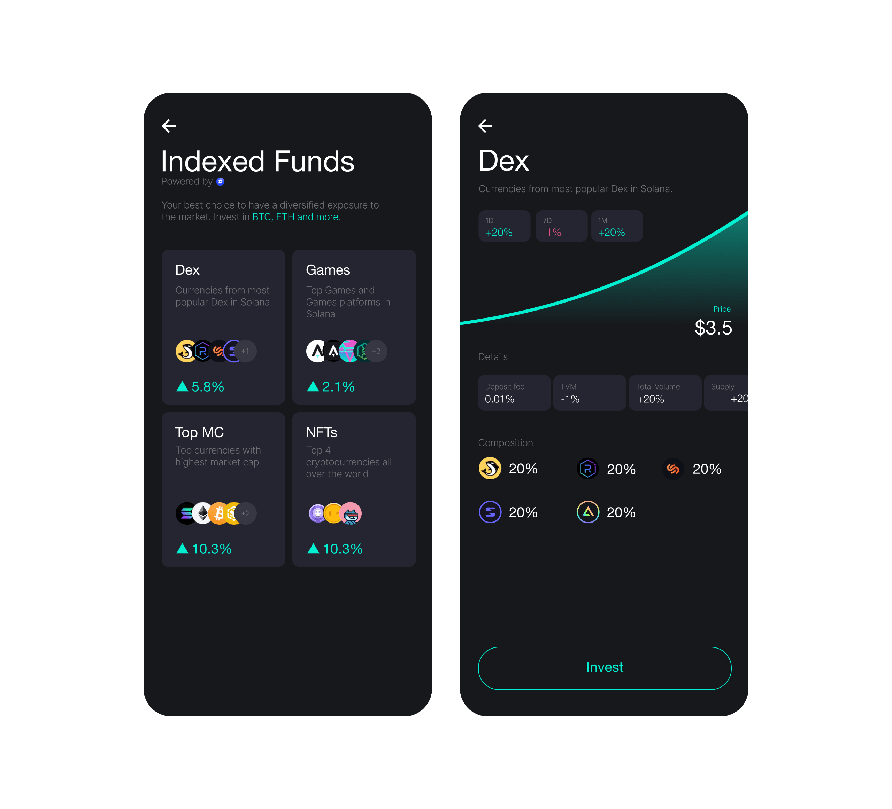

## Indexed Funds

Funds are a basket of tokens where users can buy a portion of that basket and
earn as the value of all tokens in the fund increase.

Ned Finance uses [Symmetry](https://symmetry.fi/) as the platform to manage its
funds. We have different types of funds that match different invesment profiles,
for example, top market cap fund, only games fund, only DeFi funds, and so on.

:::info

Ned funds are created and managed by Ned Finance.

:::
