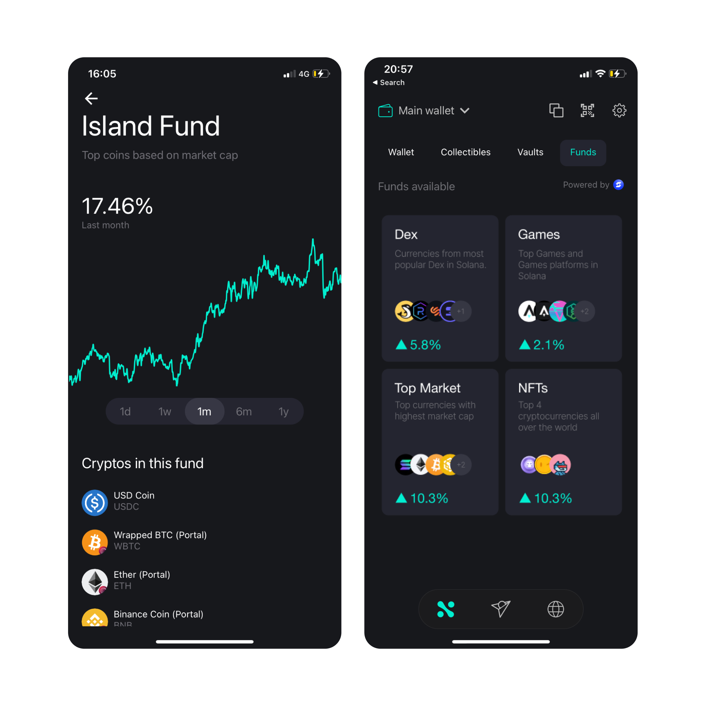

# Investments

**Ned Wallet** has different protocols integrated to help users to get more from
their crypto. We have two options to allow users to grow their money, indexed
funds and staking.

## Indexed Funds

Ned Finance uses [Symmetry](https://symmetry.fi/) as the platform to manage its
funds. We have different types of funds that match different invesment profiles,
for example, top market cap fund, only games fund, only DeFi funds, and so on.

:::info

Ned Finance will add more investment options in a regular basis.

:::
