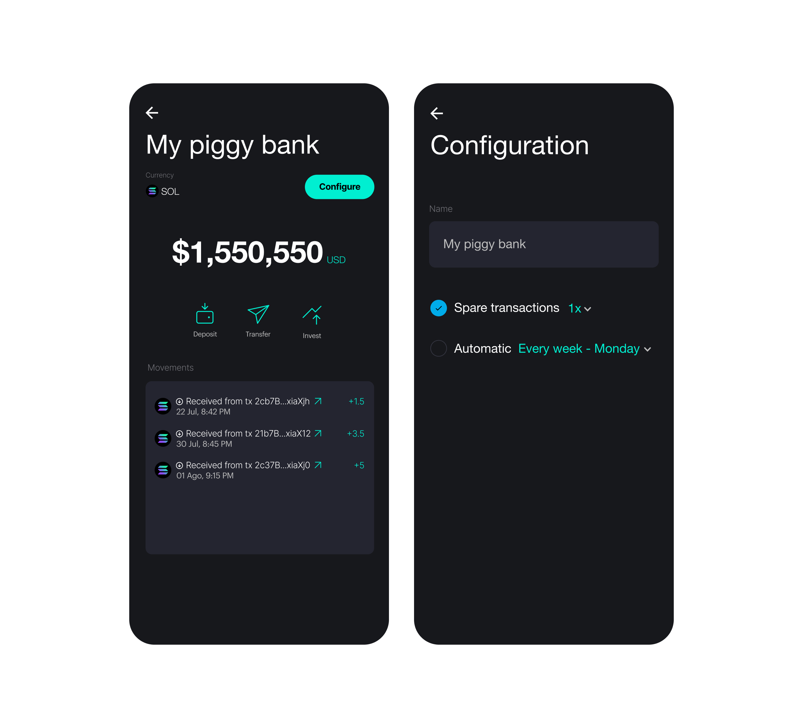

# Savings

Users can create savings accounts and choose between our two models of savings
accounts:

- Spare transactions
- Automatica savings

## Spare transactions

This feature will round up every transaction decimal and save that diffrence to
the savings accounts, for example let's imagine a transaction of 1.45 USDC,
since we are rounding up 0.55 USDC will be transfered to the savings account.
The user can choose if we wants the spare by 1x, 2x or 3x which is the maximum
amount. In case user choose 3x, the difference 0.55 will be multiplied by 3 so
0.55 \* 3 = 1.65 USDC will be deposited to the savings account.

## Automatic savings

This feature will transfer automatically every x days (this is set by the user)
an specific amount (also se by the user) to the savings account.

:::info

If the user doesn't have enough balance in his account to complete the transfer
it will just deposit to the savings account the amount available and will inform
the user about it.

:::
