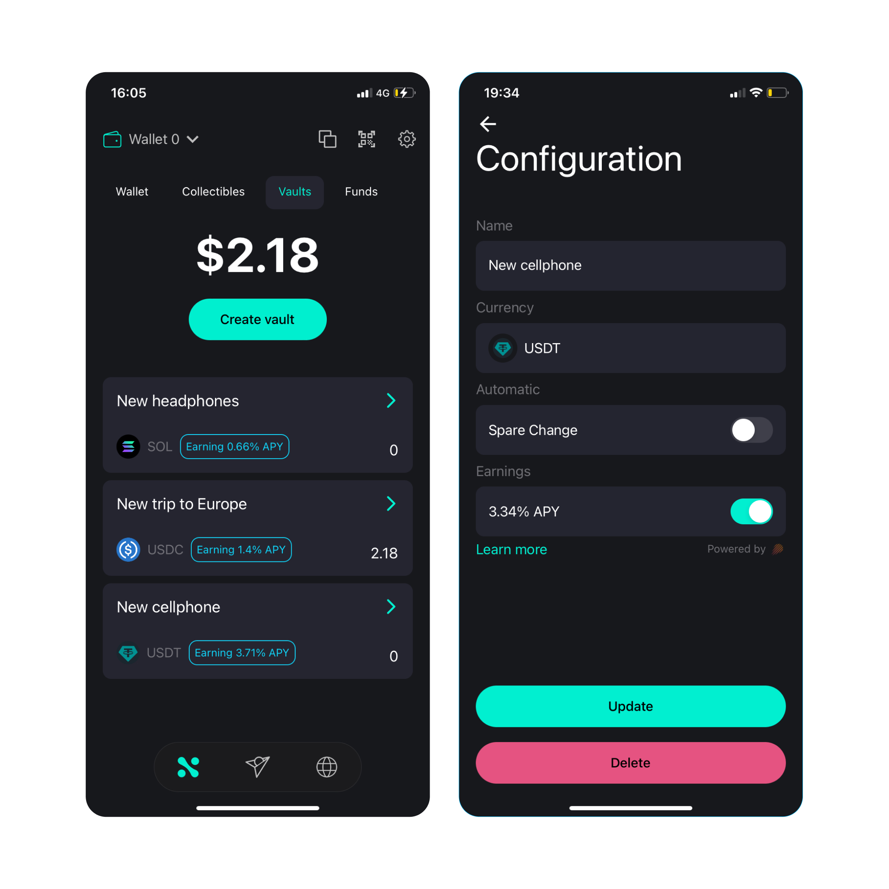

# Vaults

Users can create vaults as saving accounts and enable two options:

- Earnings
- Spare change

## Earnings

This feature will invest the funds in this vault as soon as they are deposited
in the vault through NED. Manual deposits or Spare Change deposits are sent
directly to provide liquidity and get yield if this option is enabled.

## Spare Change

This feature will round up every transaction decimal and save that diffrence to
the savings accounts, for example let's imagine a transaction of 1.45 USDC,
since we are rounding up 0.55 USDC will be transfered to the savings account.
The user can choose if we wants the spare by 1x, 2x or 3x which is the maximum
amount. In case user choose 3x, the difference 0.55 will be multiplied by 3 so
0.55 \* 3 = 1.65 USDC will be deposited to the savings account.

:::info

- If the user doesn't have enough balance in his account to send to the vault
  the transaction will be sent without depositing to the vault.
- If the token being transfered is not the same of the vault, NED will try to
  swap before sending it to the vault. If the swap fails because there is no
  available route, slippage or any reason, only the transfer will be sent.

:::
